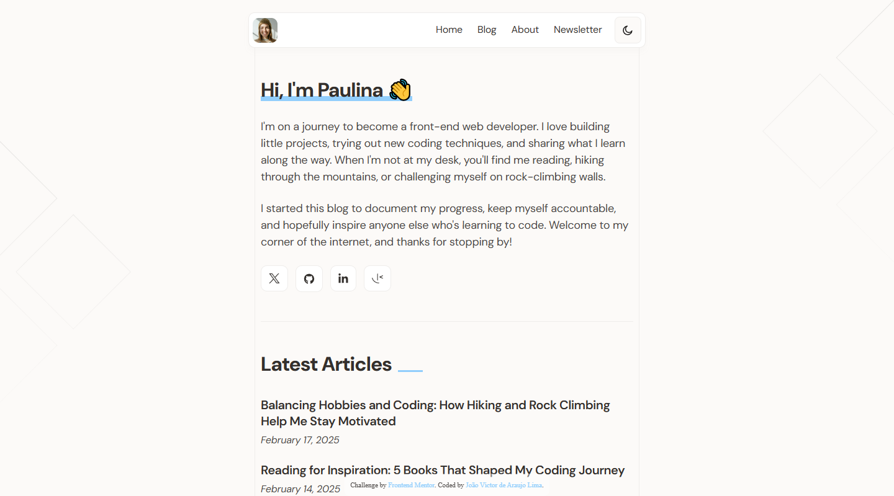
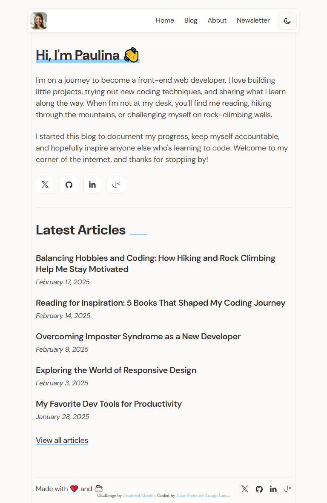
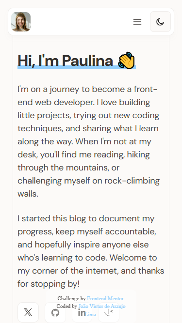
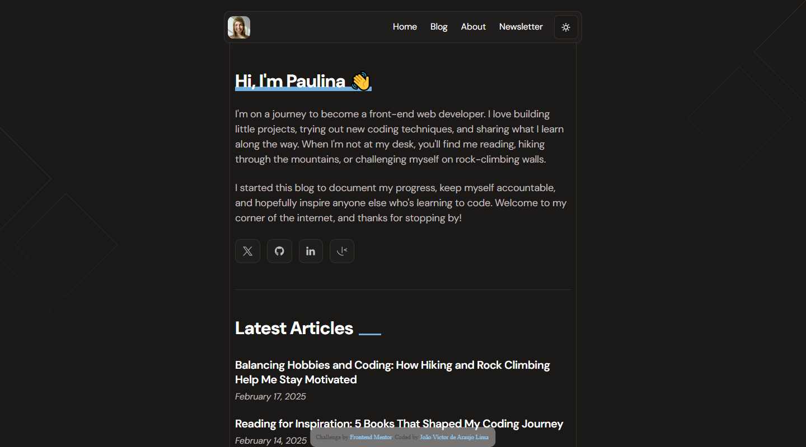
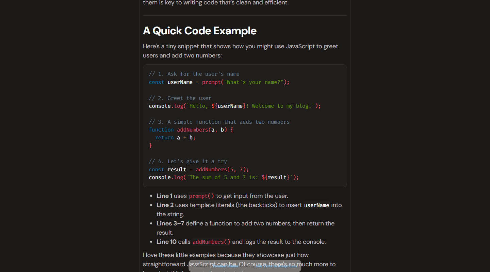
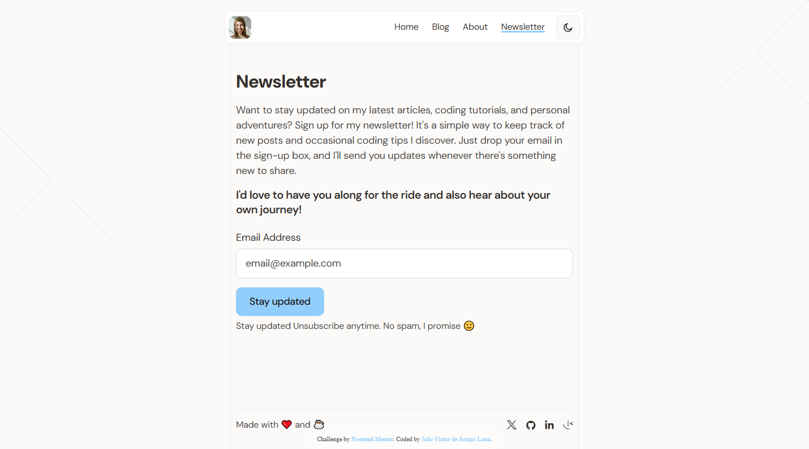

# Frontend Mentor - Personal blog solution

## Languages

This first section is in English.

[Versão em português logo abaixo.](#portuguese)

## Context

This is a solution to the [Personal blog challenge on Frontend Mentor](https://www.frontendmentor.io/challenges/personal-blog-lJpVCnmozL). Frontend Mentor challenges help you improve your coding skills by building realistic projects.

> Your challenge is to build out this personal blog and get it looking as close to the design as possible.

## Table of contents

- [Overview](#overview)
  - [The challenge](#the-challenge)
  - [Screenshot](#screenshot)
  - [Links](#links)
- [My process](#my-process)
  - [Built with](#built-with)
  - [What I learned](#what-i-learned)
  - [Useful resources](#useful-resources)
- [Author](#author)

## Overview

### The challenge

Users should be able to:

- Navigate to all pages by clicking links or using their keyboard
- Read all articles
- Select their color theme
- Submit their email to subscribe to the newsletter
- Receive an error message when the newsletter form is submitted if:
  - The Email Address field is empty
  - The Email Address is not formatted correctly
- Receive a success message if submitted correctly
- View the optimal layout for the interface depending on their device's screen size
- See hover and focus states for all interactive elements on the page

### Screenshot

#### Desktop

<p align="center">
  
</p>

#### Tablet

<p align="center">
  
</p>

#### Mobile

<p align="center">
  
</p>

#### Other pages - Desktop

<p align="center">
  
</p>

<p align="center">
  
</p>

<p align="center">
  

### Links

- Solution URL: [GitHub Repository](https://github.com/xuaun/personal-blog-challenge) and [my Frontend Mentor solution page](https://www.frontendmentor.io/solutions/responsive-personal-blog-aSdZ3LDyhr)
- Live Site URL: [Live Page](https://xuaun.github.io/personal-blog-challenge/)

## My process

### Built with

- Semantic HTML5 markup
- CSS custom properties
- Flexbox
- CSS Grid
- Media Query + clamp()
- JavaScript
- Local JSON
- PRISM.js library

### What I learned

In this project I was able to use flexbox, Grid, and CSS variable, as well as using a ready-made Figma design to create this component. I also used `rem` for measurements, `clamp()` and media query to help with responsiveness, and BEM methodology for naming classes.

In this project I also used JavaScript for the hamburger menu, generate an HTML page from a local JSON file with Markdown formatting, and check a form input.

I'm very happy to have been able to develop this code, it was a challenge that I was able to enjoy and learn a lot from!

```js
import { renderScreen } from "./screen.js";

fetch("./src/json/data.json")
  .then((response) => response.json())
  .then((posts) => {
    const urlParams = new URLSearchParams(window.location.search);
    const slug = urlParams.get("article");

    const post = posts.find((p) => p.slug === slug);

    renderScreen(post);
  })
  .catch((error) => {
    console.error("Error loading JSON file:", error);
  });
```

### Useful resources

- [Prism JS Library](https://prismjs.com/) - This library helped me a lot with formatting the `<code>` tag in CSS.

## Author

- Website - [João Víctor de Araujo Lima's Portfolio](https://xuaun.github.io/)
- Frontend Mentor - [@xuaun](https://www.frontendmentor.io/profile/xuaun)


---

<br>

# <p id="portuguese">Frontend Mentor - Solução do projeto de Blog Pessoal</p>

## Contexto

Esta é uma solução para o [desafio de um blog pessoal no Frontend Mentor](https://www.frontendmentor.io/challenges/personal-blog-lJpVCnmozL). Os desafios do Frontend Mentor ajudam você a melhorar suas habilidades de codificação construindo projetos realistas.

> Seu desafio é criar este blog pessoal e deixá-lo o mais próximo possível do design.

## Lista de conteúdos

- [Visão Geral](#visão-geral)
  - [Desafio](#desafio)
  - [Prints](#prints)
  - [Links](#links-pt)
- [Meu processo](#meu-processo)
  - [Tecnologias utilizadas](#tecnologias-utilizadas)
  - [O que eu aprendi](#o-que-eu-aprendi)
  - [Recursos úteis](#recursos-úteis)
- [Autor](#autor)

## Visão Geral

### Desafio

Os usuários devem ser capazes de:

- Naveguar para todas as páginas clicando em links ou usando o teclado
- Ler todos os artigos
- Selecionar o tema de cor
- Enviar o e-mail para assinar o newsletter informativo
- Receber uma mensagem de erro quando o formulário do newsletter informativo for enviado se:
  - O campo Endereço de e-mail estiver vazio
  - O endereço de e-mail não estiver formatado corretamente
- Receber uma mensagem de sucesso se enviado corretamente
- Ver o layout ideal para a interface dependendo do tamanho da tela do dispositivo
- Ver os estados de hover e focus para todos os elementos interativos na página

### Prints

#### Computador

<p align="center">
  
</p>

#### Tablet

<p align="center">
  
</p>

#### Celular

<p align="center">
  
</p>

#### Outras páginas - Desktop

<p align="center">
  
</p>

<p align="center">
  
</p>

<p align="center">
  
</p>

### <p id="links-pt">Links</p>

- Link da solução: [Repositório no GitHub](https://github.com/xuaun/personal-blog-challenge) e a [página da minha solução no Frontend Mentor](https://www.frontendmentor.io/solutions/responsive-personal-blog-aSdZ3LDyhr)
- Site com a solução: [Página do projeto no ar](https://xuaun.github.io/personal-blog-challenge/)

## Meu processo

### Tecnologias utilizadas

- HTML5
- CSS
- Flexbox
- CSS Grid
- Media Query + clamp()
- JavaScript
- JSON local
- Biblioteca PRISM.js

### O que eu aprendi

Neste projeto eu pude utilizar conceitos de flexbox, Grid e de variáveis no CSS, além de usar um design pronto do Figma para a elaboração deste componente. Eu também usei `rem` para medidas, `clamp()` e Media Query para ajudar na responsividade e metodologia BEM para nomear classes.

Neste projeto eu também usei JavaScript para o menu hamburguer, gerar uma página HTML a partir de um arquivo JSON local com formatação Markdown e verificar um input de um formulário.

Estou bastante feliz de ter conseguido desenvolver este código, foi um desafio que pude aproveitar e aprender bastante!

```js
import { renderScreen } from "./screen.js";

fetch("./src/json/data.json")
  .then((response) => response.json())
  .then((posts) => {
    const urlParams = new URLSearchParams(window.location.search);
    const slug = urlParams.get("article");

    const post = posts.find((p) => p.slug === slug);

    renderScreen(post);
  })
  .catch((error) => {
    console.error("Error loading JSON file:", error);
  });
```

### Recursos Úteis

- [Biblioteca Prism JS](https://prismjs.com/) - Esta biblioteca me ajudou bastante com a formatação da tag `<code>` no CSS.

## Autor

- Website - [Portfólio - João Víctor de Araujo Lima](https://xuaun.github.io/)
- Frontend Mentor - [@xuaun](https://www.frontendmentor.io/profile/xuaun)
